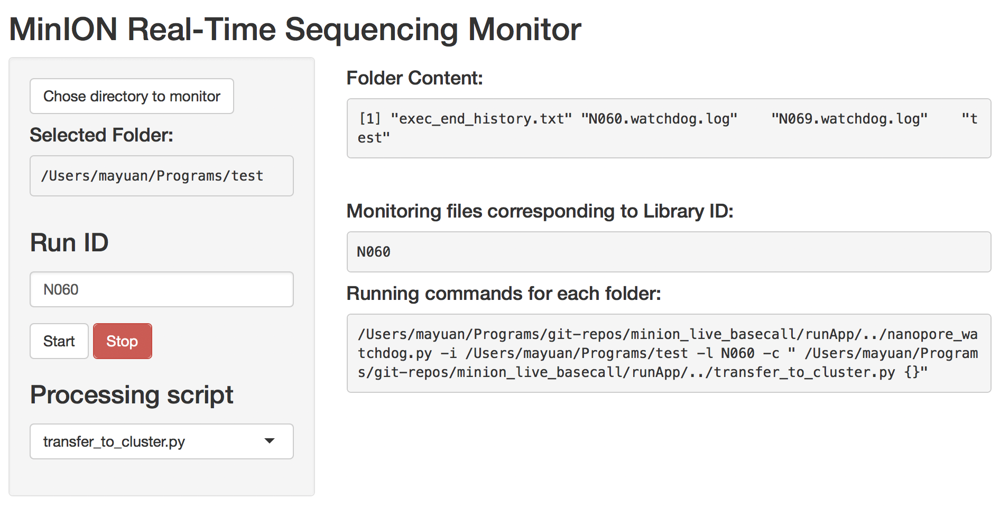

# MinION live basecall utilities

## Description

I would like to build a cross-platform framework for processing Nanopore MinION sequencing data **LIVE**. The framework should have the following properties:
1. Easy installation 
    - A docker image is created for windows users
2. User friendly
    - Web (shiny) app GUI for intiutive usage	
    - One click starup
    - [ ] interactive logging for the subprocesses
3. Extendable (R shiny + Python watchdog + **Anything**)
    - [x] The GUI runs the watchdog script, generates indicator for completion, and stop the watchdog script.
    - [x] The watchdog takes care of MinKNOW generated files. It assumes that a folder is completed after 4000 fast5 files are generated.
    - [ ] And many more opportunities... 
    	- [x] Live basecall: script "transfer_to_cluster.py" is used for compressing the completed folder, transferring it to the cluster and informing NGSP for basecall with their framework.
    	- [ ] Live assembly?
    	- [ ] Live mapping?
    	- [ ] Live metagenomics? Real-time detection of genes, pathogens, etc.

## How does it work?

The main script `nanopore_watchdog.py` monitors a MinKNOW created dircetory structure for any I/O events:

```
├── exec_end_history.txt
├── exec_start_history.txt
├── experimental_history.txt
├── intermediate
├── reads
│   ├── 20171220_0718_{LibID e.g N069}_FLO-{FlowCellID e.g. MIN107}_SQK-{KitID e.g. LSK308}
│   │   └── fast5
|...
```

The script detect creation of the numbered folders (fast5/0, fast5/1, ...) and the fast5 files (ending with "fast5") in the folders. It keeps track of the file number of each folder. Once a folder has 4000 reads, it will call a processing script (e.g. `transfer_to_cluster.py`).

MinKNOW will write information to `exec_end_history.txt` after a run finishes. The script then submit the last folder, which contains less than 4000 reads usually.

## Usage:

### Using docker image (Any platform)
```{sh}
cat DOCKER_FILE | docker build  - -t watchdog
docker run -it   --rm -p 3838:3838   -v PATH_TO_REPO/minion_live_basecall/:/srv/shiny-server/ -v /var/log/:/var/log/shiny-server/ -v PATH_TO_DATA:/home/data watchdog bash
```

This will mount:
    - the script directory to `/srv/shiny-server/` for accessing the scripts and the shiny app.
    - `/var/log/` to `/var/log/shiny-server` for any **shiny** produced log files.
    - path to be monitored (MinKNOW's data directory) to `/home/data` for monitor inside the docker image

Access the app at <http://localhost:3838/runApp/>.

### Using the shiny app (MacOS and Linux)

Start the shiny app in terminal:
```{sh}
R -e "shiny::runApp('PATH_TO_REPO/minion_live_basecall/runApp', port=XXXX)"
```


Access in browser at <http://127.0.0.1:XXXX> (XXXX is the port number above), or <http://localhost:XXXX>.

### Using command line version
```{sh}
PATH_TO_REPO/nanopore_watchdog.py -i <Folder to monitor> -l <Lib ID> -c "PATH_TO_REPO/transfer_to_cluster.py {}"
```


## Dependency of scripts
* Docker image:
    - Docker
* ShinyApp:
    - System
        - Linux or MacOS
    - Python (>3)
        - python-tk (only Linux)
        - watchdog
    - R (>3.4)
        - shiny
        - shinyFiles
* Sub-functions
    - Transfer to cluster
        - pymongo (python)  
        - rsync (Linux or MacOS)
